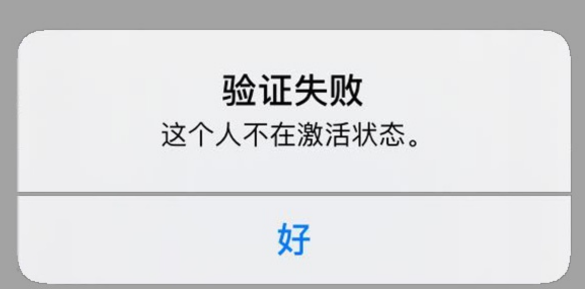
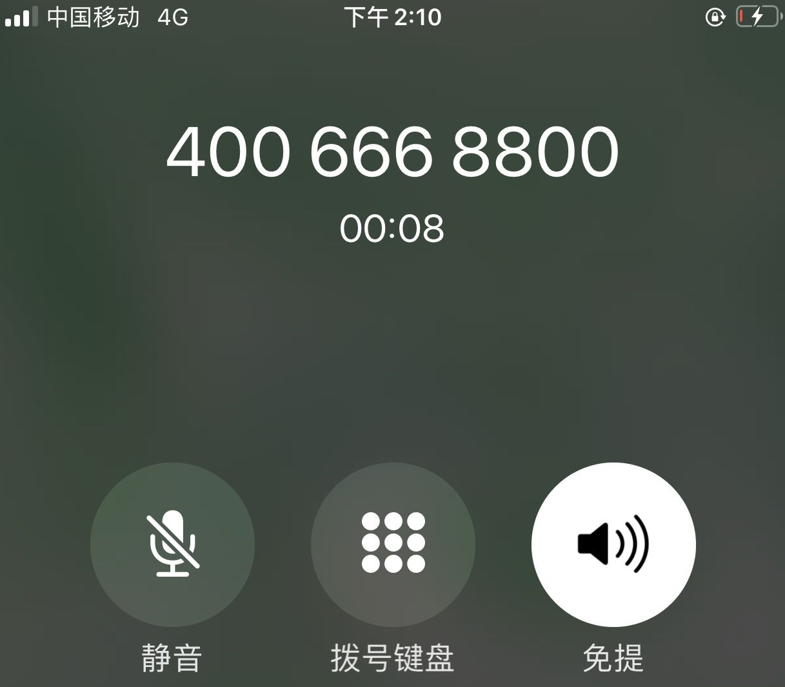

# Apple ID提示不在激活状态？

#### Apple ID不在激活状态？不少iPhone用户都会拥有两个或以上 Apple ID，方便下载国区和外区的APP。但是最近苹果的风控又严了，导致苹果id提示不在激活状态。

#### 遇到这种情况，多半是因为账号被系统判断为存在异常，因此进行了封禁。想要解决问题，必须寻求苹果官方客服的帮助。

#### 首先致电 400-6668800（早上9：00到晚上9：00），电话拨通之后根据提示选择相应的人工服务。

#### 客服接通电话之后跟客服说：我ID提示未激活，帮我重新激活一下或者说到大陆出差旅游来了，目前账号提示未激活需要处理。

#### 然后客服会帮你解决，过程中客服可能会让你提供密保问题，所以账号的密保一定要记得。

#### 如果是国外账号，还需要转接到国外客服（客服说中文)，转到国外可能时间稍微长点（一般需要等待5-10分钟）。接通后客服同样会问一些问题，然后帮你恢复账号。

#### 温馨提示：

1. 请务必记住安全提示问题的答案，客服会在电话里询问。
2. 不要使用共享账号登录iCloud，推荐直接购买独立安全账号 【[苹果APPLE ID独享账号购买](https://1234.dog)】
