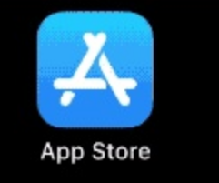
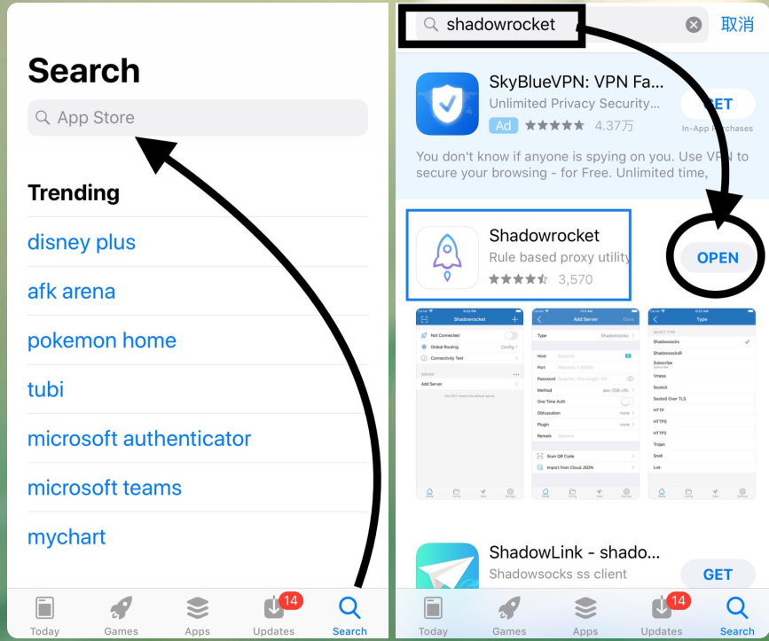

# 如何安全使用共享Apple ID？

使用共享账号请勿登录iCloud，很多新手不清楚iCloud和App Store其实是可以分别登陆的，共享账号只能在App Store登陆。

若你不小心登录icloud后，共享账号是任何人都可以查看你手机的照片信息，并查找你的手机并密码锁定，导致你的隐私泄露，甚至导致你的手机变成砖头。

为了避免共享账号各种问题，我们推荐可以直接购买独立私人独享账号 【[苹果APPLE ID独享账号购买](https://1234.dog)】

下面教程告诉你如何只登录App Store安全的下载各种软件，而避免共享账号上述问题

#### 1、打开你 iOS 设备上的 App Store 应用程序。不能在设置里面登录！！

#### 2、在 App Store 屏幕底部，轻点“Today”。在屏幕顶部右侧，轻点头像的登录按钮。登录共享或者购买的apple id账号。

.png>)

#### 3、在搜索框输入你需要下载的软件全称，然后点击安装即可。

#### 4、下载完成后务必及时**退出共享账号**，避免手机隐私泄露

#### 温馨提示：

1. 切记勿使用共享账号登录iCloud，同时避免手机隐私泄露。
2. 推荐直接购买独立账号 【[苹果APPLE ID独享账号购买](https://1234.dog)】

