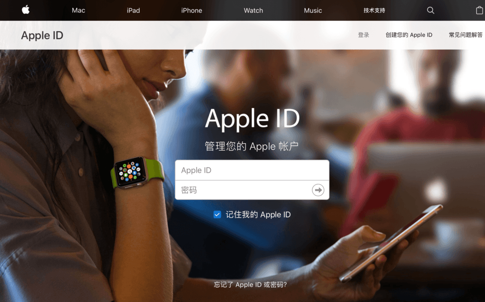

# 如何登录Apple ID管理中心？

#### 1、使用电脑登录Apple ID管理中心： [https://appleid.apple.com/#!\&page=signin](https://appleid.apple.com/#!\&page=signin)

#### 2、输入你购买的Apple ID账号和密码（任何国家一样操作），然后按照提示输入安全提示问答，然后点击「继续」

如出售的Apple ID初始密保资料是：

【生日】1989年08月08日，你少年时代最好的【朋友】叫什么名字？答：asw11，你的理想【工作】是什么？答：ddaa，你的【父母】是在哪里认识的？答：cadfg

#### 3、当提示“Apple ID安全”的时候，在下面选项中选择“其他选项”。

#### 4、跳出“保护您的账户”后，选择“不升级”。

#### 5、进入Apple ID管理中心后，先点「编辑」，修改「姓名」，「出生年月日」，在「联络方式」非大陆ID，千万不要添加手机号。非大陆ID一但添加手机号，或者从iCloud登录，都可能导致封号

#### 6、在下面的「安全」界面里选择「更改密码」，「更改安全提示问题」及「添加救援电子邮箱」，其中「救援邮箱」的意思是指的密保邮箱，双重最好在手机上也开启。其实修改了密码和密保问答就已经相当安全了。

操作完以上步骤后，你的账户可以说是绝对的安全了，只要你自己不泄露资料，这个ID谁都无法更改任何信息。所以，修改完成后一定要牢记你自己的密保资料，如果连你自己都无法记得，谁也帮不了你了。

**注意不要修改国家和送货与收获地址，也不要进行修改。如果自行修改的，可能会导致账号无法使用。**

#### 温馨提示：

1. 非大陆ID，一定不要从iCloud登录，从App Store登录下载APP就行，也不要绑定手机，更不要共享给别人使用，自己用就行了，最近苹果风控较严格，使用人过多不同ip登录也可能导致账号被禁用。
2. 不要使用共享账号登录iCloud，推荐直接购买独立安全账号 【[苹果APPLE ID独享账号购买](https://1234.dog)】
