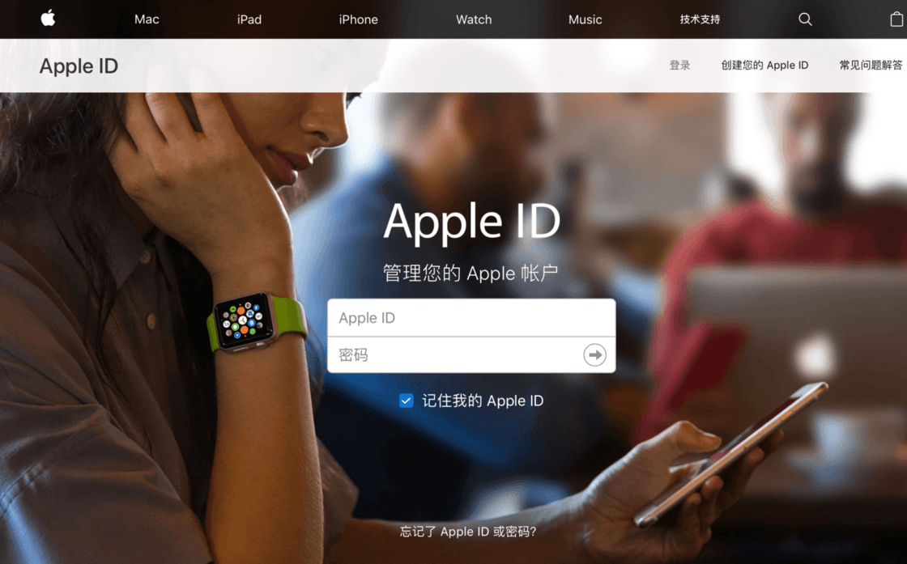

# 如何更改Apple ID电子邮件？

#### 1、前往 [appleid.apple.com](https://appleid.apple.com) 并登录。

#### 2、在 “帐户” 中，选择“编辑”。

#### 3、选择 “更改 Apple ID”。

.jpg>)

#### 4、输入您要使用的新电子邮件地址。

#### 5、选择 “继续”。

#### 6、如果您将 Apple ID 更改为第三方电子邮件地址，请检查您的电子邮件以获取验证码，然后输入验证码。

#### 温馨提示：

1. 一旦换成 Apple 系的邮箱（@icloud.com）就不能再更换成第三方的邮箱地址作为 Apple ID。
2. 不要使用共享账号登录iCloud，推荐直接购买独立安全账号 【[苹果APPLE ID独享账号购买](https://1234.dog)】

&#x20;&#x20;
