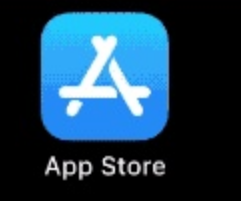

# 如何使用Apple兑换码？

### 一、美国区兑换码使用文字描述方法步骤：

#### 1、ios11及以上版本

App Store商店首页→屏幕右上角登录美国区苹果账号→找到(redeem gift card or code)→屏幕中间(you can also enter your code manually)输入兑换码→点右上角Redeem

#### 2、ios10及以下版本

App Store商店首页→屏幕最下方登录美国区苹果账号→点Redeem→屏幕中间(you can also enter your code manually)输入兑换码→点右上角Redeem

### 二、美国区兑换码使用图文描述方法步骤：

#### 1、打开你 iOS 设备上的 App Store 应用程序。

#### 2、在 App Store 屏幕底部，轻点“Today”。在屏幕顶部右侧，轻点头像的登录按钮。登录apple id账号。

#### 3、在底部找到并点击「兑换」Redeem Gift Card or Code输入兑换码按钮。

#### 4、App Store 将会弹出确认兑换使用的 Apple ID 窗口或者第一次使用App Store协议，输入密码后点击「OK好」按钮，Agree同意按钮。

#### 5、输入你得到的兑换码，然后点击右上角的「兑换」Redeem按钮完成兑换。

#### 6、点击右上角的「完成」按钮返回至 App Store。

#### 温馨提示：

1. 苹果 App Store 的条款有说明指出，如果你本人不在你使用的 Apple ID 对应的国家，尤其是登录icloud使用，则你的账号随时可能会被封，你可以尝试拨打苹果400申请解封，若运气不好被封了之后你只能再重新购买账号。
2. 不要使用共享账号登录iCloud，推荐直接购买独立安全账号 【[苹果APPLE ID独享账号购买](https://1234.dog)】
