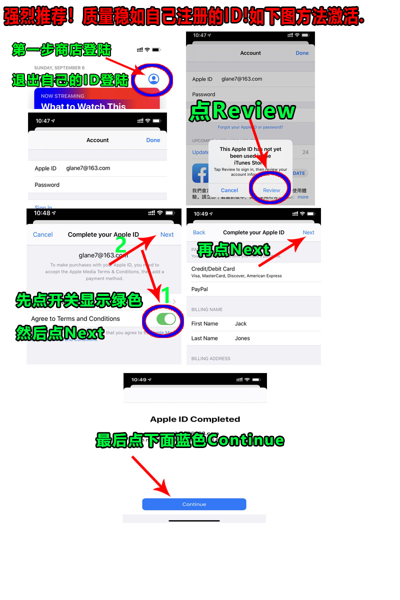

# 未激活iCloud的账号过检查？

#### 1、打开你 iOS 设备上的 App Store 应用程序。不要在设置APP里面登录！！

#### 2、在 App Store 屏幕底部，轻点“Today”。在屏幕顶部右侧，轻点头像的登录按钮。登录购买的apple id账号。

.png>)

#### 3、输入ID之后先点过检查（Review），接着点下同意条款，然后点下一页（NEXT）右上角！

#### 4、最后不要选支付方式直接点下一页（NEXT）即可！切记不要选支付方式！

#### 温馨提示：

不要使用共享账号登录iCloud，推荐直接购买独立安全账号 【[苹果APPLE ID独享账号购买](https://1234.dog)】
